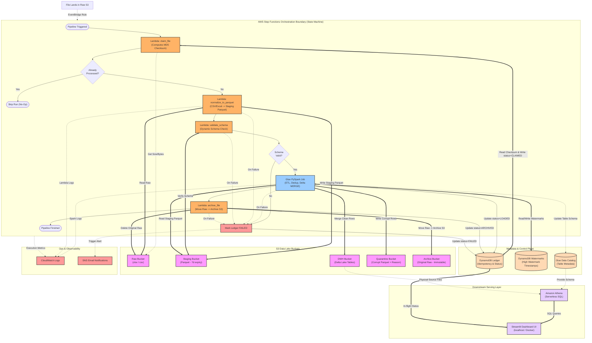

# E-Commerce Lakehouse: Architecture Diagram & Orchestration Flow

This document defines the new architecture diagram and explains how all components are grouped, focusing on what is encapsulated within the **AWS Step Functions** orchestration boundary.

---

## 1. Architecture Flow Diagram (Mermaid)

The diagram below represents the end-to-end data pipeline. The **AWS Step Functions Orchestration** boundary (represented by the large green container) encapsulates the active execution logic of the pipeline.

---

## 2. Explanation of Encapsulated Steps inside the Step Functions Boundary

The State Machine acts as the orchestrator (the "brain") that sequentially invokes functions, handles branching, manages states, and catches exceptions. Here is what happens inside:

1. **`claim_file` Lambda:** Reads the file key and raw S3 metadata to compute the file's MD5 checksum. It queries **DynamoDB Ledger** to check if the file is new or failed. If it is already processed or currently processing, it flags the run as a duplicate (`already_processed: True`).
2. **Choice State (`Already Processed?`):** Evaluates the boolean output. If `True`, the pipeline terminates immediately (`Skip Run`) with a success state, preventing redundant resource consumption.
3. **`normalize_to_parquet` Lambda:** Converts CSV/Excel files into standardized Parquet. It reads from the **Raw S3 bucket** and writes to the **Staging S3 bucket** with custom folder partition keys (`batch_id`).
4. **`validate_schema` Lambda:** Validates the schema of the Parquet file.
5. **Choice State (`Schema Valid?`):** If the schema is invalid, the pipeline branches to the failure state. If valid, it triggers the AWS Glue Job. This "fail fast" mechanism saves PySpark compute start-up cost.
6. **Glue PySpark Job:** Performs ETL. It reads from **Staging**, validates rows (e.g. primary keys), writes invalid rows to **Quarantine**, merges valid rows into the target **Delta Table** in **DWH S3**, updates the **Glue Data Catalog**, and writes the loaded metrics into the **DynamoDB Ledger**.
7. **`archive_file` Lambda:** Moves the raw file from the **Raw bucket** to the **Archive bucket** and deletes the raw file from Raw. It then marks the ledger status to `ARCHIVED`.
8. **Catch Block (`Mark Ledger FAILED`):** If any of the above Lambdas or the Glue job fails, the Step Functions state machine catches the exception, updates the **DynamoDB Ledger** table to `FAILED` (with the error message), and triggers an **SNS Email Alert** to notify operators.

---

## 3. Improvements Over the Previous Diagram

1. **Clear Boundaries:** The Step Functions state machine is enclosed in a single container box. You can clearly see how the EventBridge trigger enters the box, and how the internal states (`claim_file` -> `Choice` -> `normalize` -> `validate` -> `Glue` -> `archive`) proceed sequentially.
2. **Detailed Lambdas:** Rather than a single vague "Lambda" block, the diagram explicitly breaks down the **four Lambdas** (`claim_file`, `normalize_to_parquet`, `validate_schema`, and `archive_file`) representing their actual jobs and interactions.
3. **Control Plane Connections:** It clearly illustrates that DynamoDB Ledger is accessed at the beginning (`claim_file`), during the run (`Glue_ETL`), at the end (`archive_file`), and on failure (`State_Fail`).
4. **Ops & Observability Integration:** It maps exactly how exceptions are caught, logging into CloudWatch, and propagating failures to SNS Email Alerts.
