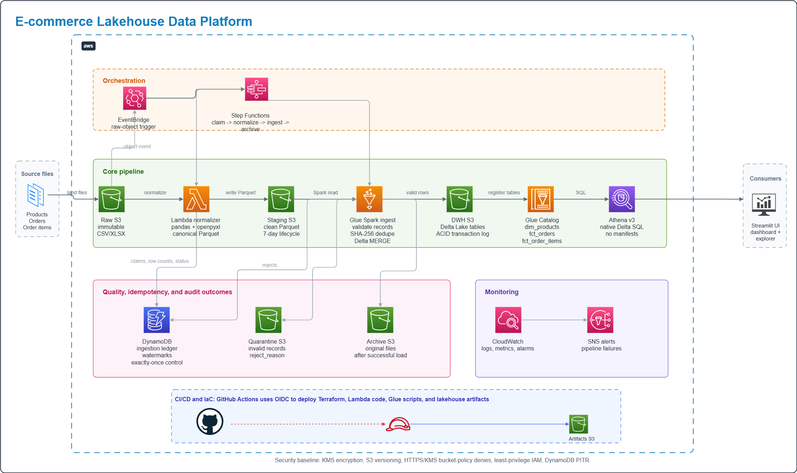

# ecom-lakehouse

A production-grade data lakehouse on AWS for processing e-commerce transactions — raw files in, clean Delta tables out, queryable via Athena.

---

## Architecture



---

## What It Does

E-commerce platforms generate a continuous stream of transactional data: products, orders, and line items. This data arrives in different formats (CSV, Excel), at irregular times, and with no guarantees of cleanliness.

This project is a complete implementation of that ingestion system on AWS using the medallion lakehouse pattern — data moves through clearly defined, independently recoverable stages from raw to clean.

**Key properties:**

- **Exactly-once processing** — DynamoDB tracks every file's lifecycle. The same file landing twice is processed once; a crashed Glue job can be retried safely.
- **ACID writes** — Delta Lake via Spark MERGE means no partially-written tables on failure.
- **Separation of concerns** — each stage has its own compute, IAM role, storage zone, and failure mode. A bad record doesn't abort an otherwise clean batch.
- **Full auditability** — raw files are preserved forever, rejected records land in quarantine with a reason, and the Delta transaction log is the history of every table write.

---

## Pipeline

```
Raw S3  (xlsx / csv land here, immutable)
  │
  ▼ Lambda — pandas/openpyxl
Staging S3  (Parquet, 7-day expiry)
  │
  ▼ AWS Glue + Spark
  ├── DWH S3        (Delta tables — ACID, Athena-queryable)
  └── Quarantine S3 (rejected records + reason)
  │
  ▼ Lambda
Archive S3  (original raw files after successful load)
  │
  ▼
Glue Catalog + Athena  (native Delta, no manifests, no MSCK REPAIR)
```

Coordinated end-to-end by **AWS Step Functions** — retries, failure branching, SNS alerting, and sequential stage dependencies are all in the state machine.

---

## Datasets

| Table | Source | Rows | Notes |
|-------|--------|------|-------|
| `dim_products` | CSV | ~1,000 | Product dimension, 6 departments |
| `fct_orders` | Excel | ~500 | One row per order |
| `fct_order_items` | Excel | ~2,700 | One row per line item |

Validation is enforced at ingest time: null PKs, invalid timestamps, and broken FK references are quarantined — not silently dropped.

---

## Repository Layout

```
ecom-lakehouse/
├── src/
│   ├── lakehouse/      # Reusable Spark library (schemas, validation, transforms, merge)
│   ├── glue_jobs/      # Glue entrypoints — thin wrappers calling the library
│   ├── normalize/      # Lambda normalizer (xlsx/csv → Parquet)
│   ├── lambdas/        # Claim, archive, validate-schema Lambdas
│   └── ui/             # Streamlit dashboard
├── infra/
│   ├── modules/        # Terraform modules: s3, iam, glue, dynamodb, lambda, stepfunctions
│   └── envs/dev/       # Dev environment tfvars + backend
├── orchestration/      # Step Functions ASL state machine definition
├── tests/
│   ├── unit/           # Spark library tests, no AWS
│   ├── integration/    # End-to-end job tests against local Delta
│   └── fixtures/       # Sample data including intentionally dirty records
├── scripts/
│   ├── smoke_test.py           # Post-deploy infrastructure validation
│   └── set_aws_profile.ps1     # Load sandbox credentials into AWS profile
├── .github/workflows/
│   ├── ci.yml          # Lint, scan, test, terraform validate
│   └── deploy.yml      # Terraform apply + artifact upload + smoke test (main only)
└── docs/               # Planning documents covering every subsystem
```

---

## Infrastructure

`terraform apply` in `infra/envs/dev` provisions:

- 7 S3 buckets — KMS encryption, HTTPS + KMS-enforce bucket policies, versioning, lifecycle rules
- 2 DynamoDB tables — ingestion ledger + watermarks
- 3 Lambda functions with IAM roles
- 1 Glue job (parameterized per dataset) + Glue Data Catalog with 3 native Delta table definitions
- 1 Step Functions Standard state machine
- 1 Athena workgroup
- CloudWatch log groups, dashboard, and pipeline-failure alarm
- SNS topic + email alert subscription
- EventBridge rule on Glue job failure
- GitHub OIDC trust for keyless CI/CD authentication

---

## CI/CD

Every push runs: lint (black, isort, flake8), secret scanning, unit tests, integration tests, terraform validate.

Every push to `main` additionally runs: terraform apply, wheel + Glue script upload to S3, smoke test.

No static AWS keys anywhere — GitHub Actions authenticates via OIDC, scoped to `refs/heads/main` on this repository.

---

## Local Development

```bash
# Install with dev tooling
pip install -e ".[dev]"

# Run tests
make test

# Lint
make lint

# Terraform plan (no apply)
make plan
```

---

## Cost

Estimated cost per deploy-test-destroy cycle on dev: **under $1.00**.

Run `terraform destroy` after smoke testing — the sandbox account has a limited budget.
